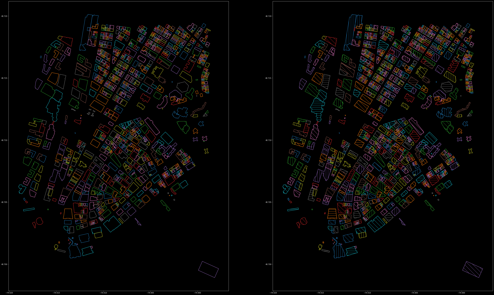

# ValidateOSM
---

ValidateOSM is a framework in progress to validate data from the free, editable geographic database OpenStreetMap
(OSM). This is currently done by comparing the information available on OSM with other public--but not editable--sources
of geographic data. This project would drastically reduce the amount of entries that would otherwise have to be manually
inspected for false data. Once finished, this project could be used a tool to fix data on OSM that would otherwise be
erroneous, and increase the reliability and validity of introspections made from public data on OSM. Although currently
validating the height of buildings according to OSM, this project will hopefully expand to validate other information
availaible on OpenStreetMaps, such as a street's width and directionality, to be then used in subsequent investigations.

The need for such a framework was mentioned in the following works: 
[placeholder]

The project is currently in development by: 
Daniel Hodczak 
with guidance and advising by: 
Fabio Miranda

# Table of Contents
---

1. [Installation](#installation)
2. [Grouping](#grouping)
3. [Discrepancies](#mismatches)
4. [API](#api)

## Installation
---
[placeholder] 

## Grouping
---
Currently, a query is made for entries that have the tag 'building' or 'building:part' within a specified region.
Entries that have enumerative data, seperated with semicolons, are expanded into several entries with the same
respective ID. For every member associated, a Relation assigns its ID to the member's Relation entry. Finally, geometric
overlaps resolve any redundancies for OSM entries otherwise unrelated by 'Way' or 'Relation' by grouping any entries
that have geometric entries with one another. This procedure takes many OSM entries that may or may not be explicitly
related, and flattens them into a 2D-representation of a real-world building.  

This is a pseudo-colormap of the results of the aforementioned process, applied to OSM Building data of the
south-western part of Manhattan. On the left are the various entries that have been determined to comprise a building;
on the right are flattened data entries with single value-attributes instead of multiple-value attributes, for each
building that the geometric border represents:   

Once the OSM entries, the 'needles', are grouped, the geometric boundaries are then applied to other sources of data,
the 'haystack', creating matches and potentially grouping geometries that were previously independent. This is a
pseudo-colormap of a grouping made by the 'haystack':    

For each group in either the 'needles' or the 'haystack', the entries are compressed into a single entry per group,
representative of the data available from that group. In the case of validating a building's height, the height is
extracted as the maximum height of all the entries. After the entries have been flattened, there is a one-to-one
relationship between the buildings in the needles and the buildings in the haystack. Here is a pseudo-colormap with the
needles on the left, and the haystack on the right. Unmatched geometries are given in grey:  

## Discrepancies
---
With a one-to-one relationship established between needle abstractions and haystack abstractions, discrepancies between
the data can be determined. If an OSM entry defines the construction date to be newer than the date of the data in the
haystack, the match can be thrown out. These matches are as of now the end product of this framework: From this, one may
have a smaller list of entries in OSM to manually validate, as well as a list of entries in OSM that may be more
reliably used for investigations otherwise susceptible to errors, outdated information, or malicious behavior.  

## API
---

### Source

The *Source* class is the base class for which all data will be extracted with.  
[placeholder]

### Needles

The *Needles* class inherits from *Source*, and is in charge of extracting data from OpenStreetMaps.
[placeholder]

### Haystack

The *Haystack* class inherits from *Source*, and implements little functionality. It is to be derived from when defining
another class which handles how data is extracted from a non-OSM source.
[placeholder]

### Mixins

The ValidateOSM framework works with mixin abstract base classes to add modularity and uniformity to Sources.
Inheritance from such a class necessitates that a Source is implemented, and also establishes what kind of column type
that data is.
[placeholder]

### Columns

#### Identifier

A unique, real-world identifier that may be used to match information from different datasets without the use of
geometric information.

#### EssentialData

Data to be extracted from a dataset regardless of whether it is explicitly called for or not. Without this, the
*Source* will lose functionality.

#### NonEssentialData

Data that may be extracted if explicitly called for by the user, however is otherwise extraneous. An address, for
example, is unreliable for matching, but may however be used to manually identify entries.

#### Validating

The data that is to be ultimately validated by the framework. 
